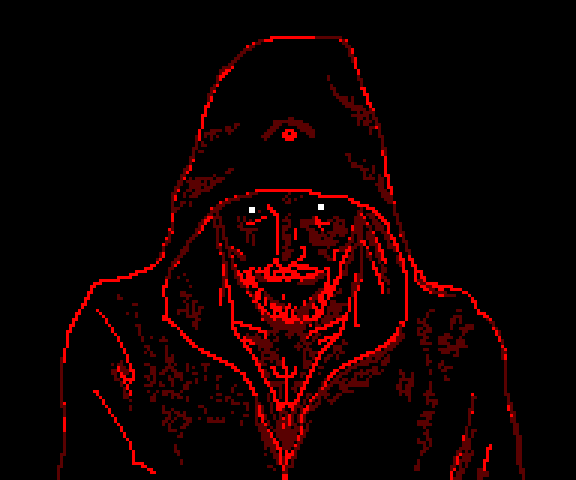

## АНДРОМЕДА-13

Этот билд был обработан темнейшим из преисподни говнокодеров.. Дальше бога нет.

Дальше только Rewokin и его код, что походит на говноруны...

**Обратите внимание, что этот репозиторий содержит материалы сексуального характера и не подходит для лиц младше 18 лет!**

Андромеда-13 - это комьюнити по 2D космонавтикам, что было сформировано 24.12.2022, было в пике и падении. Но основной пласт игроков по сей день держится вместе.

Билд на базе Howling Void, что была на базе Nova Sector, что была на базе /tg/station, созданное в byond.

Space Station 13 — это адский симулятор космического хаоса с ролевой отыгровкой, где ты можешь быть клоуном, устроившим кровавый карнавал в отделе безопасности, предателем, подрывающим реактор под маской мирного инженера, или генетиком, случайно превратившим весь экипаж в ходячих бананов. Здесь двери ущемляют анробастов, провода убивают, в атмосферу выпускают плазму, а клоуна бьют за то, что он клоун. Админ то спавнит метеоритный дождь из бананов, то устраивает зомби-апокалипсис посреди смены. Это игра, где твой лучший друг может внезапно выстрелить тебе в спину, а капитан станции — оказаться клонированным шесть раз подряд мартышкой. Здесь нет правил, есть только веселье, предательство и тонны крови на полу.

## Ссылки

[Дискорд](https://discord.gg/NxTZeUPtRf)

## Документация

- Чтобы познать древние руны, нужна волшебная [книга](https://secure.byond.com/docs/ref/#/DM).

## Контрибьют (Помощь в разработке)

Мы рады принять вклад от любого человека. Заходите в Discord, если хотите помочь.
Только убедитесь, что ваши изменения и PRы/ПРы соответствуют простым пунктам.

1. Не говнокодить, используйте мозг
2. Провести тест, пожалейте Ревокина
3. Название и описание (фото/видио к ПРу по желанию)
4. Перед отправкой зайти обновить свой форк (Sync fork), если это не сделать, ожидайте спортиков у двери.
5. Если ваш форк давно не обновлялся, то после (Sync fork) проведите тесты ещё раз. Ведь за это время могло что-то измениться и ваш красивый код, превратится в нерабочий кусок говна.

## Скачать

[Скачать](.github/guides/DOWNLOADING.md)

[Запуск сервера](.github/guides/RUNNING_A_SERVER.md)

[Карты и прочее](.github/guides/MAPS_AND_AWAY_MISSIONS.md)

## Компиляция

Найдите файл `BUILD.bat` в корневой папке tgstation и дважды щёлкните по нему, чтобы начать сборку. Сборка состоит из нескольких этапов и может занять от 1 до 5 минут.

**Долгий путь**. Найдите `bin/build.cmd` в этой папке и дважды щёлкните по нему, чтобы начать сборку. Сборка состоит из нескольких этапов и может занять от 1 до 5 минут. Если она закроется, это означает, что работа завершена. Затем вы можете [настроить сервер](.github/guides/RUNNING_A_SERVER.md) обычным способом, открыв `tgstation.dmb` в DreamDaemon.

\*\*Сборка таким образом устарела и может вызывать такие ошибки `'tgui.bundle.js': cannot find file`.

**[Как скомпилировать в VSCode и другие параметры сборки](tools/build/README.md).**

## Начало работы

Руководства по контрибуции см. в [Руководствах для контрибуторов](.github/CONTRIBUTING.md).

Информацию о начале работы (среда разработки, компиляция) см. в документе HackMD [здесь](https://hackmd.io/@tgstation/HJ8OdjNBc#tgstation-Development-Guide).

Общую проектную документацию см. в [HackMD](https://hackmd.io/@tgstation).

Информацию о [истории проекта] см. в [Common Core](https://github.com/tgstation/common_core).

## ЛИЦЕНЗИЯ

Весь код после [коммита 333c566b88108de218d882840e61928a9b759d8f от 31.01.2014 в 16:38 PST](https://github.com/tgstation/tgstation/commit/333c566b88108de218d882840e61928a9b759d8f) распространяется по лицензии [GNU AGPL v3](https://www.gnu.org/licenses/agpl-3.0.html).

Весь код до [коммита 333c566b88108de218d882840e61928a9b759d8f от 31.02.12 в 16:38 PST](https://github.com/tgstation/tgstation/commit/333c566b88108de218d882840e61928a9b759d8f) распространяется по лицензии [GNU GPL v3](https://www.gnu.org/licenses/gpl-3.0.html).

Включая инструменты, если в их readme-файле не указано иное.)

Подробнее см. LICENSE и GPLv3.txt.

TGS DMAPI распространяется как подпроект по лицензии MIT.

Информацию о лицензии MIT см. в нижнем колонтитуле [code/\_\_DEFINES/tgs.dm](./code/__DEFINES/tgs.dm) и [code/modules/tgs/LICENSE](./code/modules/tgs/LICENSE).

Все ресурсы, включая иконки и звук, находятся под лицензией [Creative Commons 3.0 BY-SA](https://creativecommons.org/licenses/by-sa/3.0/), если не указано иное.
